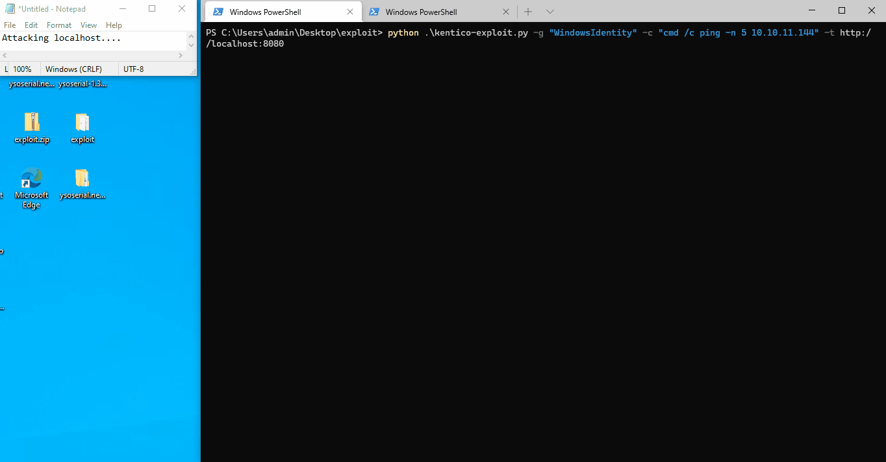
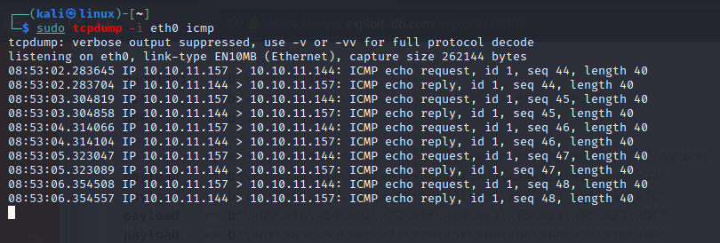

# Kentico 11 & 12 Remote Code Execution

Kentico <=11.0.47 & <=12.0.14 versions are vulnerable to a remote code execution via the SyncServer.asmx.

A ysoserial.net payload is generated using the "ActivitySurrogateSelectorFromFile" gadget or by using the "WindowsIdentity" gadget. The payload would be constructed from a C# file which relates to the activity gadget and will perform a simple system execution function to run a specific command such as nslookup, ping, etc. Alternatively, if using the "WindowsIdentity" gadget, you can specify a command to be executed. 

The payload will be submitted as a raw XML object to avoid misinterpretation from the server running the Kentico CMS. Then a SOAP request is sent with the payload to the server and the payload is being deserialized to perform the remote code execution.

### Example:

Windows terminal:
`python.exe kentico-exploit.py -g "WindowsIdentity" -c "cmd /c ping -n 5 <KALI_IP>"`

Upon successful request to the vulnerable server, the response code would most likely be 500:

Checking attacker's terminal with tcpdump running:

Thanks to:
    @Artur Gemes
    @Jake Bolam

For being of much help !

Reference: https://www.aon.com/cyber-solutions/aon_cyber_labs/unauthenticated-remote-code-execution-in-kentico-cms/